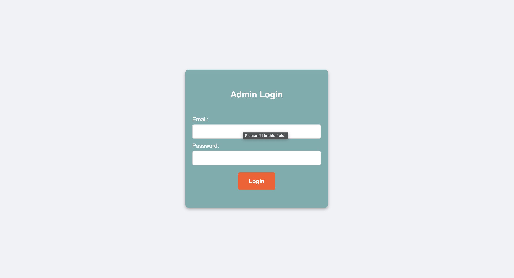
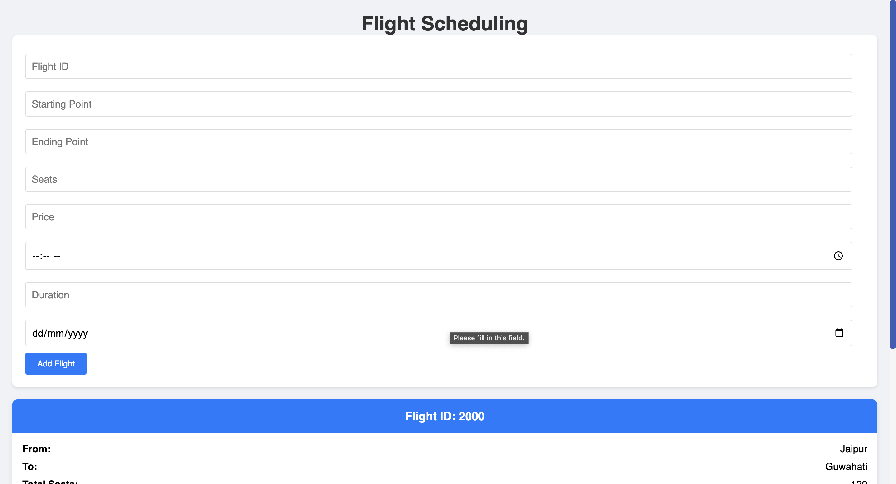

# Flight Management System

## Overview

The Flight Management System is a full-stack application designed to manage flight data and user bookings. The backend provides capabilities to add, update, and delete flight information, while the frontend allows users to search for flights, book flights, and handle user authentication (login and signup).

## Tech Stack

- **Frontend:** React
- **Backend:** Node.js
- **Database:** MongoDB

## Features

### Backend
- Add new flights
- Update existing flight details
- Delete flights

### User Side
- Search for flights
- Book flights
- User authentication (Login and Signup)


## User Interface
<p >
  
  
  
  
  
</p>

## Admin Interface
<p >
  
  
</p>


## Getting Started

### Prerequisites

Make sure you have the following installed on your system:
- Node.js
- npm (Node Package Manager)
- MongoDB

### Installation

1. **Fork the Project**

   Fork this repository to your own GitHub account.

2. **Clone the Repository**

   ```bash
   git clone https://github.com/shivaga/flight-management-system.git
   ```

3. **Navigate to the Project Directory**

   ```bash
   cd flight-management-system
   ```

### Starting the Backend Server

1. **Navigate to the Backend Directory**

   ```bash
   cd backend
   ```

2. **Install Backend Dependencies**

   ```bash
   npm install
   ```

3. **Start the Backend Server**

   ```bash
   node app.js
   ```

### Starting the Frontend Server

1. **Install Frontend Dependencies**

   ```bash
   npm install
   ```

2. **Start the Frontend Server**

   ```bash
   npm start
   ```

## Project Structure

```
flight-management-system/
│
├── backend/
│   ├── app.js
│   ├── mongo.js
│   ├── ...
│   └── ...
│
├── frontend/
│   ├── public/
│   ├── src/
│   ├── package.json
│   └── ...
│
└── README.md
```

### Backend Directory

- **app.js:** Entry point for the backend server.
- **mongo.js/:** Contains Mongoose models for MongoDB.

### Frontend Directory

- **public/:** Public assets and the main HTML file.
- **src/:** React components and main application logic.
- **package.json:** Frontend dependencies and scripts.

## Contributing

Contributions are welcome! Please fork the repository and create a pull request with your changes.

## Contact

For any questions or suggestions, please open an issue or contact the project maintainer.

---

Thank you for using the Flight Management System! Happy coding! 🚀